# MedGuard AI

Drug safety assessment system analyzing interactions, side effects, and treatment appropriateness.

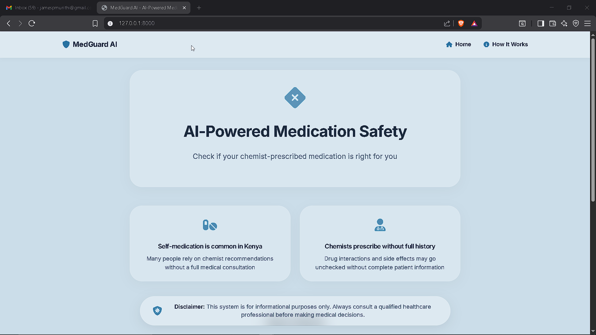

## Features

Drug interaction detection • Treatment validation • Side effect analysis • Alternative suggestions • Semantic search • Name normalization

## Screenshots

### Home & Form
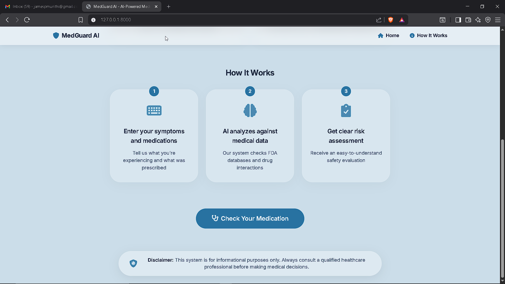
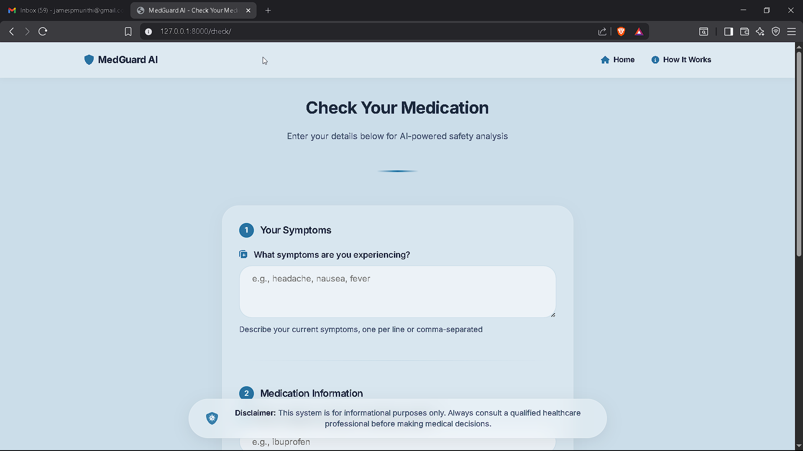
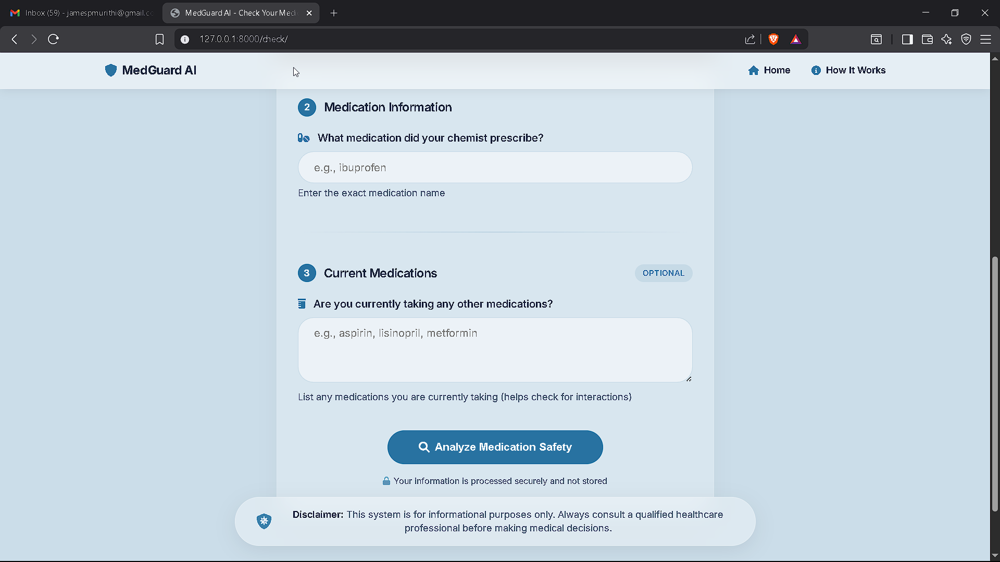

### Results
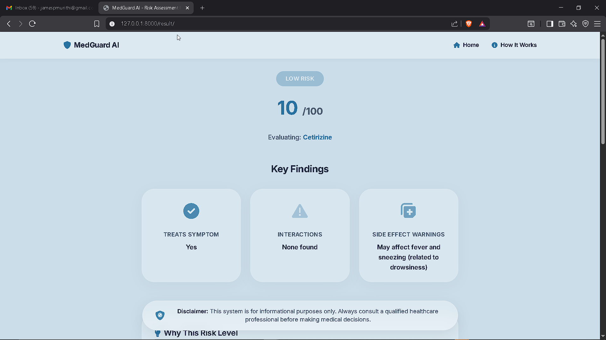
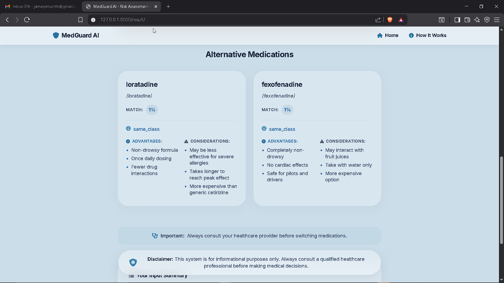
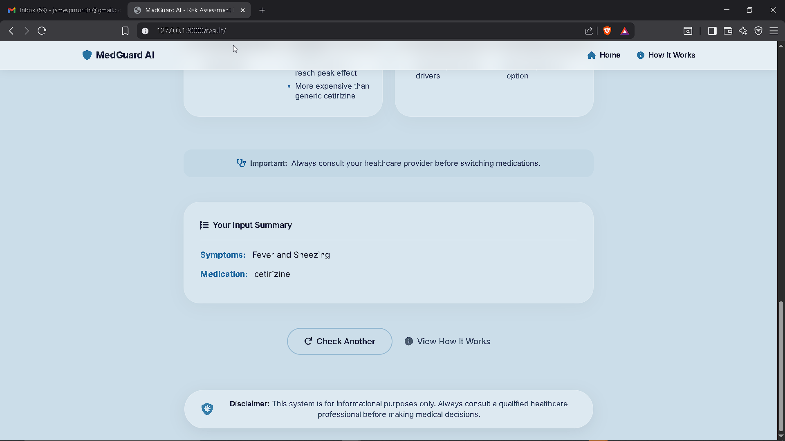
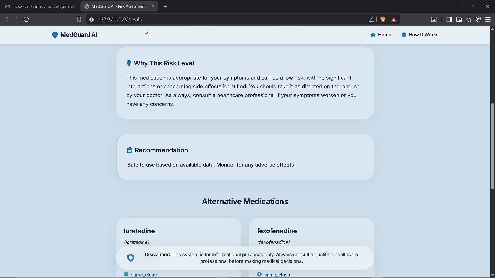

### How It Works
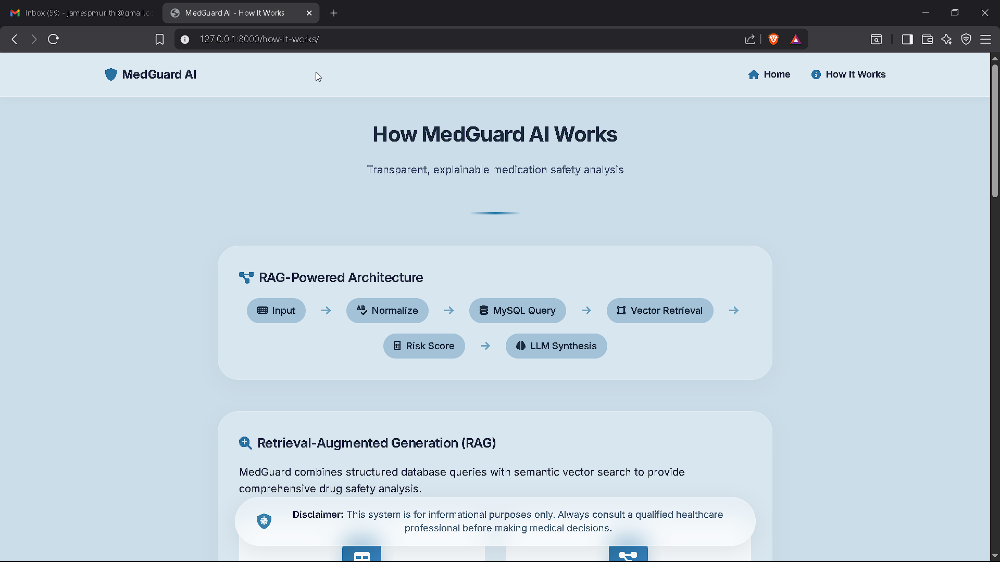
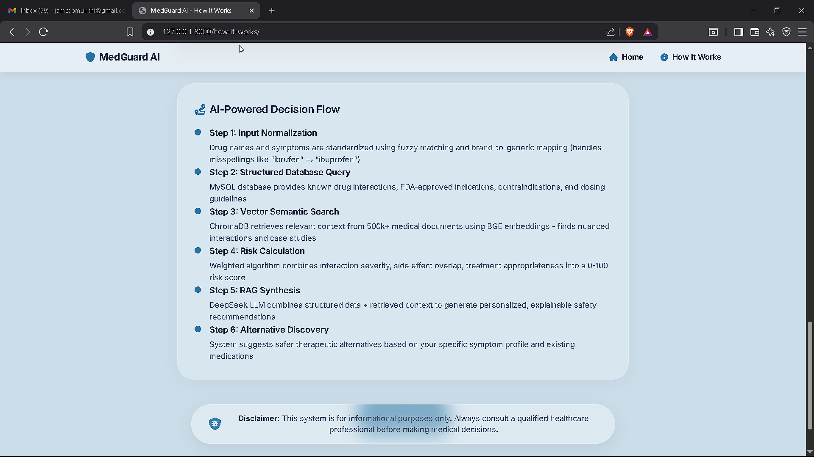
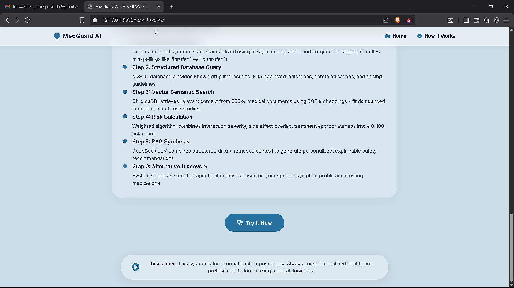
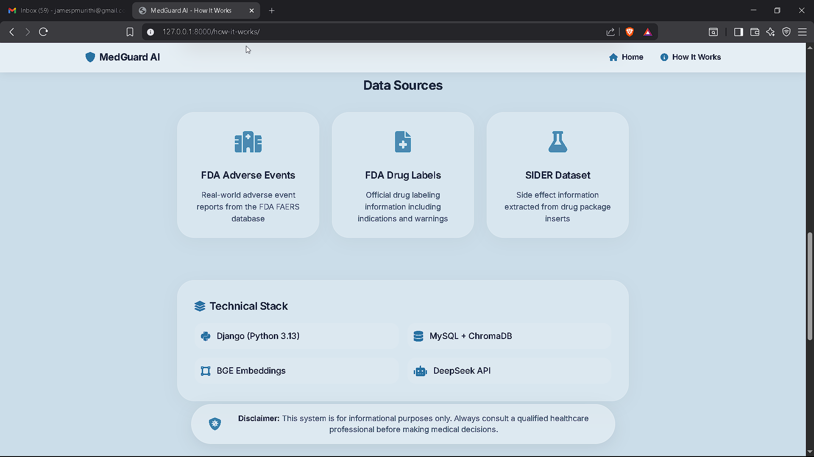
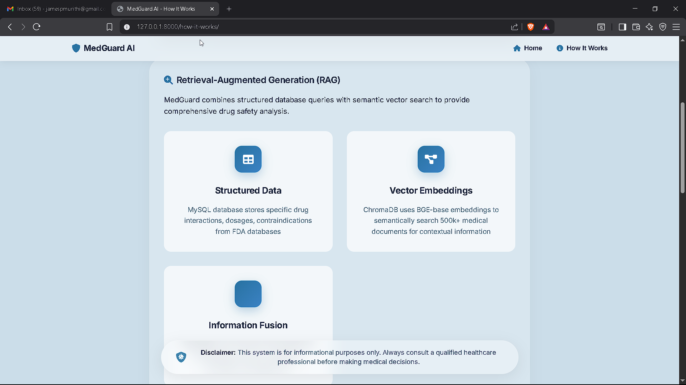

## Risk Scoring

| Level | Score | Points |
|-------|-------|--------|
| **LOW** | 0-25 | Safe |
| **MEDIUM** | 26-60 | Caution |
| **HIGH** | 61+ | Not recommended |

**Components:** Contraindicated (50) • Major (30) • Moderate (15) • Minor (5) • Mismatch (40) • Side Effects (1-30)

## Installation

```bash
git clone <repo-url>
cd medguard_v1

# Setup
uv venv && source .venv/bin/activate  # Windows: .venv\Scripts\activate
uv sync

# Configure
cp .env.example .env

# Database
python manage.py migrate
python manage.py migrate_hardcoded_data

# Run
python manage.py runserver
```

Visit http://127.0.0.1:8000

## Usage

**Web:** Enter symptoms → medication → current meds → get assessment

**Testing:**
```bash
python run_comprehensive_tests.py --level basic
python manual_test.py --scenario high_risk
```

## API

```python
from medguard_app.orchestrator import get_decision_pipeline

result = get_decision_pipeline().evaluate(
    symptoms=["headache", "fever"],
    proposed_drug="ibuprofen",
    existing_drugs=["lisinopril"]
)
# Returns: risk_score, risk_level, findings, recommendations, alternatives
```

## Tech Stack

Django 6.0 • ChromaDB • Sentence Transformers • RapidFuzz • SQLite/MySQL

## Contributing

See [CONTRIBUTING.md](CONTRIBUTING.md) for guidelines on reporting issues, suggesting features, and submitting pull requests.

## Documentation

- [Manual Test Inputs](MANUAL_TEST_INPUTS.md) - Copy-paste test scenarios
- [Testing Guide](TESTING_GUIDE.md) - Comprehensive testing instructions
- [Test Data Documentation](test_data_comprehensive.md) - Detailed test case specs

## Disclaimer

Educational purposes only. Not a substitute for professional medical advice.

## License

MIT License - See [LICENSE](LICENSE) for details
